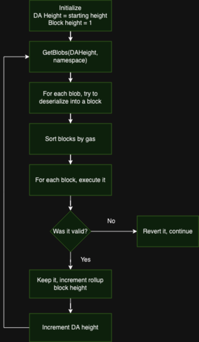

# whimsifall-rs


## Overview
Whimsifall is a based rollup on Celestia, written in Rust.



## Getting Started

### Install dependencies

1. If you are on Ubuntu, first update and upgrade your OS:
    
    ```bash
    sudo apt update && sudo apt upgrade -y
    ```
    
2. Install essential packages that are necessary to execute many tasks like downloading files, compiling, and monitoring the node:
    
    ```bash
    sudo apt install curl tar wget clang pkg-config libssl-dev jq build-essential \\
    git make ncdu -y
    ```
    
### Install Golang

celestia-node is written in Golang so we must install Golang to build and run our node.

1. We are using Mocha version for the desired network:
    
    ```bash
    ver="1.21.1"
    ```
    
2. Download and install Golang:
    
    ```bash
    cd $HOME
    wget "<https://golang.org/dl/go$ver.linux-amd64.tar.gz>"
    sudo rm -rf /usr/local/go
    sudo tar -C /usr/local -xzf "go$ver.linux-amd64.tar.gz"
    rm "go$ver.linux-amd64.tar.gz"
    
    ```
    
3. Add your `/usr/local/go/bin` directory to your `$PATH` if you have not already:
    
    ```bash
    echo "export PATH=$PATH:/usr/local/go/bin:$HOME/go/bin" >> $HOME/.bash_profile
    source $HOME/.bash_profile
    ```
    
4. To verify that the correct version of Go was installed correctly run:
    
    ```bash
    go version
    ```
    

The output will show the version installed.


### Install Rust

```bash
curl --proto '=https' --tlsv1.2 -sSf <https://sh.rustup.rs> | sh
```

### Install celestia-node

1. Remove any existing copy of celestia-node, clone the repository,
and change into the directory:
    
    ```bash
    cd $HOME
    rm -rf celestia-node
    git clone https://github.com/celestiaorg/celestia-node.git
    cd celestia-node/
    ```
    
2. Check out to the desired version, based on the network you will use:
    
    ```bash
    git checkout tags/v0.12.4
    ```
    
3. Build the `celestia` binary:
    
    a. Standard build
    
    ```bash
    make build
    ```
    
4. Install the binary:
    
    ```bash
    make install
    ```
    
    ```bash
    make go-install
    ```
    
5. Build the `cel-key` utility:
    
    ```bash
    make cel-key
    ```
    
6. Verify that the binary is working and check the version:
    
    ```bash
    celestia version
    ```

### Set up a Celestia light node

Run the following command:

```
celestia light init
celestia light init --p2p.network mocha
```

The output in your terminal will show the location of your node store and
config. It will also show confirmation that the node store has been initialized.

#### Start the light node

Start the light node with a connection to a validator node's gRPC endpoint (which
is usually exposed on port 9090):

```
celestia light start --core.ip rpc-mocha.pops.one --p2p.network mocha
```

#### Keys and wallets

You can create your key for your node by running the following command with the
`[cel-key` utility](https://www.notion.so/developers/celestia-node-key) in the
`celestia-node` directory:

```
celestia light start --keyring.accname my_celes_key \\
    --core.ip rpc-mocha.pops.one --p2p.network mocha
```

Once you start the light node, a wallet key will be generated for you.
You will need to fund that address with testnet tokens to pay for
`PayForBlob` transactions.

You can [find the address using the RPC CLI](https://www.notion.so/developers/node-tutorial.md#get-your-account-address)
or by running the following command in the
`celestia-node` directory:

```
./cel-key list --node.type light --keyring-backend test \\
    --p2p.network <network>
```

#### Testnet tokens

Mocha network to get testnet tokens from:

- [Mocha testnet](https://www.notion.so/celestiaorg/mocha-testnet.md#mocha-testnet-faucet)

You can request funds to your wallet address using the following command in Discord:

```
$request <CELESTIA-ADDRESS>
```

Where `<CELESTIA-ADDRESS>` is the `celestia1******` address generated
when you created the wallet.

## Run the Rollup Script

```
bash start.sh
```
